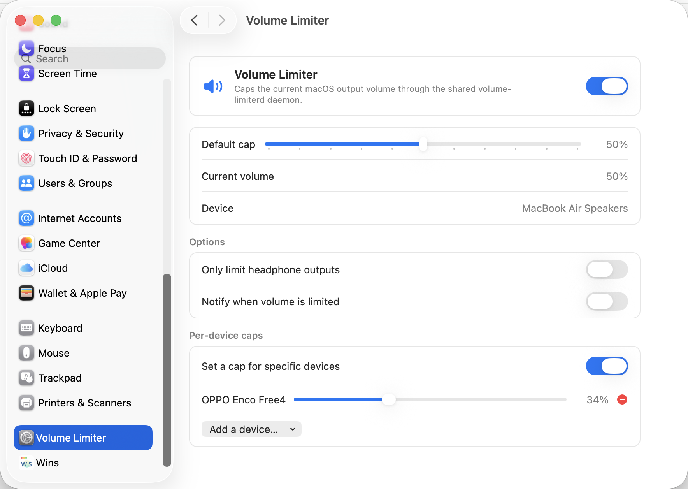

# Volume Limiter

[简体中文](README.zh-CN.md)



Volume Limiter is a lightweight macOS maximum-volume limiter. A single per-user daemon watches the current output device with Core Audio and immediately pushes volume back down when it exceeds your configured limit. The CLI and GUI are thin clients that talk to the same daemon over a Unix domain socket.

## Features

- Event-driven Core Audio monitoring; no default polling loop.
- Per-user daemon: `volume-limiterd`.
- CLI: `volume-limit`.
- GUI: ad-hoc signed `VolumeLimiter.prefPane` for macOS System Settings.
- The prefPane auto-refreshes while visible and stops refreshing when you leave it.
- Shared config owned by the daemon.
- Optional Bluetooth-only mode.
- Optional macOS notification when volume is capped.
- No kernel extension, no virtual audio driver, no Developer ID, no notarization.

## Install

Homebrew tap commands after publishing:

```bash
brew install HackwoodL/tap/volume-limiter
brew services start volume-limiter
```

GUI package after publishing:

```bash
brew install --cask HackwoodL/tap/volume-limiter-gui
```

Manual local build:

```bash
swift build
swift run volume-limiter-tests
scripts/test-cli-daemon.py
scripts/install-prefpane.sh
```

## CLI

```bash
volume-limit set <0-100>
volume-limit get
volume-limit on
volume-limit off
volume-limit status
volume-limit bluetooth-only on
volume-limit bluetooth-only off
volume-limit bluetooth-only status
volume-limit --help
```

If the daemon is not running, the CLI prints:

```text
volume-limiterd is not running.
Start it with: brew services start volume-limiter
```

## Architecture

```text
┌────────────────────────────────────────────────────────────┐
│ volume-limiterd                                             │
│ - Core Audio listeners                                      │
│ - volume clamp policy                                       │
│ - config owner                                              │
│ - Unix domain socket server                                 │
└────────────────────────────────────────────────────────────┘
                              ▲
                              │ /tmp/volume-limiter-$UID.sock
                 ┌────────────┴────────────┐
                 │                         │
┌────────────────────────────┐ ┌────────────────────────────┐
│ volume-limit                │ │ VolumeLimiter.prefPane     │
│ CLI thin client             │ │ System Settings thin client│
└────────────────────────────┘ └────────────────────────────┘
```

The daemon is the only process that calls Core Audio to read or set output volume. CLI and GUI clients only send newline-delimited JSON requests over the per-user Unix socket.

## Manual release installation

Download the release zips from GitHub:

- `volume-limiter-cli-v0.1.0.zip`: universal `arm64`/`x86_64` `volume-limiterd` and `volume-limit`
- `VolumeLimiter-gui-v0.1.0.zip`: `VolumeLimiter.prefPane`
- `SHA256SUMS`

Remove quarantine for unsigned/ad-hoc-signed downloads:

```bash
xattr -cr VolumeLimiter.prefPane volume-limiterd volume-limit
```

Install the prefPane manually:

```bash
mkdir -p ~/Library/PreferencePanes
cp -R VolumeLimiter.prefPane ~/Library/PreferencePanes/
open ~/Library/PreferencePanes/VolumeLimiter.prefPane
```

Because this project intentionally avoids a paid Apple Developer Program membership, releases are ad-hoc signed and not notarized. On first launch macOS may require right-click Open, `xattr -cr`, or approving the pane from System Settings.

## Uninstall

GUI only:

```bash
brew uninstall --cask volume-limiter-gui
```

CLI and daemon:

```bash
brew services stop volume-limiter
brew uninstall volume-limiter
```

Full cleanup:

```bash
brew uninstall --cask volume-limiter-gui || true
brew services stop volume-limiter || true
brew uninstall volume-limiter || true
rm -rf ~/Library/Application\ Support/VolumeLimiter \
       ~/Library/PreferencePanes/VolumeLimiter.prefPane \
       ~/Library/LaunchAgents/com.hackwoodl.volumelimiter.plist
```

## Testing

See [`docs/TESTING.md`](docs/TESTING.md). Current coverage includes Core policy tests, notification trigger tests, IPC protocol tests, CLI parser/rendering tests, Unix socket conflict tests, real daemon + CLI smoke tests, prefPane bundle build/sign/load checks, System Settings screenshot, keyboard volume-key latency, Bluetooth reconnect, Type-C wired headset, reboot auto-start, and a short idle resource sample.

Remaining follow-up validation: HDMI/AirPlay/aggregate/unsupported output devices when hardware is available, and Homebrew install/uninstall against the public tap after release SHA values are available.

## Preference pane status

`NSPreferencePane` is deprecated. Volume Limiter keeps it as the preferred v1 GUI because it integrates with System Settings on current macOS versions, but future macOS releases may remove or further restrict third-party preference panes. If that becomes unreliable, the fallback is a SwiftUI menu bar app that still talks to the same daemon.

## Roadmap

- v0.1.x: finish release packaging, tap publication, and manual hardware validation.
- v1.0: stable CLI + prefPane distribution.
- v2: investigate driver-layer hard interception with a Core Audio HAL virtual device. v1 deliberately does not install drivers, kexts, or virtual audio devices.

## Acknowledgements

Inspired by the thin-client daemon architecture of `batt` and by the historical preference pane references `LegacySystemPreferences` and `LegacyPreferences`.
