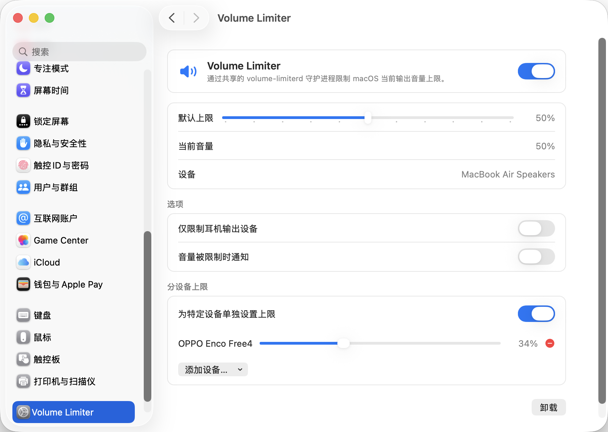

# Volume Limiter

[English](README.md)



Volume Limiter 是一个轻量级 macOS 最大音量限制器。我写它是为了防止连接新耳机时音频音量过大、伤害耳朵：它把每个输出设备限制在你设定的最大音量，一旦音量超过上限就立即压回。你可以通过「系统设置」里的面板，或一个小巧的命令行工具来控制它。

**系统要求：** macOS 13 (Ventura) 及以上，支持 Apple Silicon 与 Intel。

## 功能

- 限制最大输出音量——音量调过上限会被自动压回。
- 所有设备共用一个默认上限，并可为特定设备单独设置上限。
- 仅耳机模式：只限制耳机类输出（蓝牙、USB、Type-C 等）。
- 音量被压回时可发送通知。
- 系统设置里的图形界面与 `volume-limit` 命令行，始终保持同步。

## 安装

### 最简单：DMG 双击安装（推荐）

打开 `VolumeLimiter-<版本>.dmg`，在里面**双击 `VolumeLimiter.prefPane`**，当系统设置询问时点**安装**。后台服务会自动启动——设好上限就完事了。无需终端、无需 clone、无需 Homebrew。

卸载时，打开 系统设置 ▸ Volume Limiter，点 **Uninstall（卸载）** 即可。

> 目前还没把预编译的 DMG 发布到 Releases。在那之前，用 `scripts/build-dmg.sh` 在本地构建一个（它会打印出 `.dmg` 路径），或者用下面的一条命令源码安装。
>
> 因为我没钱买 Apple 开发者签名（Apple Developer Program），构建产物只做 ad-hoc 签名、不做 notarization。下载已发布的 DMG 后，macOS 可能要求你在 系统设置 ▸ 隐私与安全性 中批准该面板，或首次右键 ▸ 打开。

### 从源码安装

```bash
git clone https://github.com/HackwoodL/volume-limiter.git
cd volume-limiter
scripts/install-local.sh     # 一条命令装好（daemon + CLI + prefPane）
```

`install-local.sh` 会构建 universal 二进制，并把所有东西装进
`~/Library/Application Support/VolumeLimiter`（LaunchAgent 和 prefPane 在 `~/Library` 下），
不会从你的源码目录里运行任何东西。想要 DMG？改跑 `scripts/build-dmg.sh`，然后双击里面的面板即可。

CLI 安装在 `~/Library/Application Support/VolumeLimiter/bin`，把它加进 `PATH` 后即可直接用 `volume-limit`：

```bash
echo 'export PATH="$HOME/Library/Application Support/VolumeLimiter/bin:$PATH"' >> ~/.zshrc
```

开发时也可以只构建和测试、不安装：

```bash
swift build
swift run volume-limiter-tests
scripts/test-cli-daemon.py
```

### Homebrew（计划中，尚未发布）

个人 tap 发布后，一条命令即可**安装并启动**所有东西（这个 cask 携带自包含面板，面板内置后台服务和 CLI）：

```bash
brew install --cask HackwoodL/tap/volume-limiter-gui
```

卸载同样一条命令——停止服务并移除 agent、配置和面板：

```bash
brew uninstall --cask HackwoodL/tap/volume-limiter-gui
```

## 图形界面（GUI）

主界面是 **系统设置 ▸ Volume Limiter** 里的面板：

- 顶部总开关，一键启停限制。
- 默认上限滑块，适用于所有设备。
- 分设备上限——添加特定设备并各自设置上限。
- 「仅耳机模式」和「限制时通知」开关。
- 一键 **Uninstall（卸载）** 按钮。

面板会实时显示当前音量和输出设备；即使关闭面板，后台服务也会持续生效。

## CLI

```bash
volume-limit set <0-100>            # 设置适用于所有设备的默认上限
volume-limit on                     # 开启限制器
volume-limit off                    # 关闭限制器
volume-limit status                 # 打印守护进程完整状态和诊断信息
volume-limit device on|off          # 开启/关闭分设备上限功能
volume-limit device set <uid> <n>   # 为指定 UID 的设备单独设置上限
volume-limit device remove <uid>    # 移除某个设备的单独上限
volume-limit device list            # 列出各设备上限与已连接设备
volume-limit headphone-only on|off  # 仅限制耳机类输出设备
volume-limit --help                 # 显示用法
```

如果 daemon 没有运行，CLI 会提示：

```text
volume-limiterd is not running.
Open System Settings > Volume Limiter to start it.
```

## 卸载

### 最简单：卸载按钮（图形界面）

打开 系统设置 ▸ Volume Limiter，点击面板底部的 **Uninstall（卸载）** 按钮即可。它会一步停掉后台服务，并删除 LaunchAgent、保存的配置以及偏好设置面板本身。之后请退出并重新打开「系统设置」，即可将其从侧边栏清除。

### 本地安装（终端）

与按钮等效，如果你更习惯命令行：

```bash
launchctl bootout gui/$(id -u)/com.hackwoodl.volumelimiter 2>/dev/null || true
rm -rf ~/Library/Application\ Support/VolumeLimiter \
       ~/Library/PreferencePanes/VolumeLimiter.prefPane \
       ~/Library/LaunchAgents/com.hackwoodl.volumelimiter.plist
```

### Homebrew（发布后）

```bash
brew uninstall --cask HackwoodL/tap/volume-limiter-gui
```

## 架构

```text
┌────────────────────────────────────────────────────────────┐
│ volume-limiterd                                             │
│ - Core Audio 事件监听                                       │
│ - 音量封顶策略                                              │
│ - 配置管理                                                  │
│ - Unix domain socket server                                 │
└────────────────────────────────────────────────────────────┘
                              ▲
                              │ /tmp/volume-limiter-$UID.sock
                 ┌────────────┴────────────┐
                 │                         │
┌────────────────────────────┐ ┌────────────────────────────┐
│ volume-limit                │ │ VolumeLimiter.prefPane     │
│ CLI 瘦客户端                │ │ 系统设置 GUI 瘦客户端       │
└────────────────────────────┘ └────────────────────────────┘
```

只有 daemon 会调用 Core Audio 读取或修改系统输出音量。CLI 和 GUI 只通过每个用户独立的 Unix socket 发送 newline-delimited JSON 请求。

## 测试

详见 [`docs/TESTING.md`](docs/TESTING.md)。当前已经覆盖 Core 逻辑测试、通知触发测试、IPC 协议测试、CLI 解析/输出测试、Unix socket 冲突测试、真实 daemon + CLI smoke、prefPane 构建/签名/加载、系统设置截图、键盘音量键延迟、蓝牙重连、Type-C 有线耳机、重启自启和基础资源采样。

仍需后续条件满足后验证：HDMI/AirPlay/聚合设备/不支持系统音量控制设备，以及发布真实 GitHub Release/Homebrew tap 后使用正式 URL/SHA 的安装/卸载流程。

## 许可

基于 [MIT License](LICENSE) 发布。
